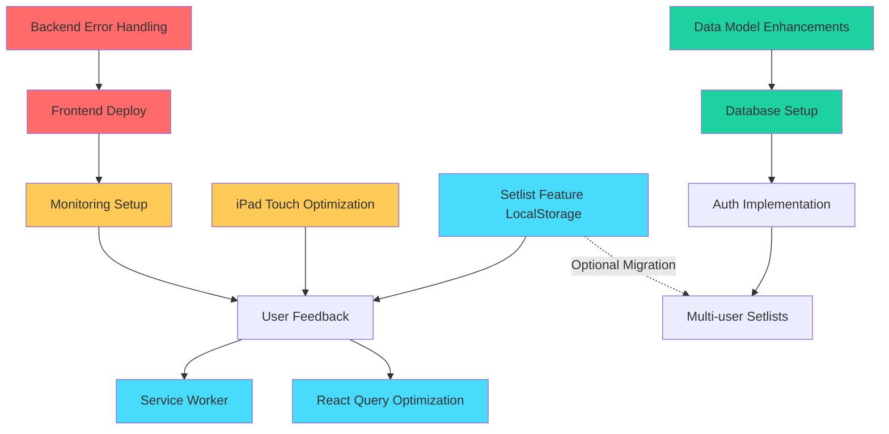

# Jazz Picker - Unified Development Roadmap
*Compiled from 4 Specialized Agents on Nov 25, 2025*

## 📊 Complete Priority Matrix

| Priority | Feature | Agent | Effort | Impact | Cost | Dependencies |
|----------|---------|-------|--------|--------|------|--------------|
| **CRITICAL** | Frontend Deployment | DevOps | 4 hours | 🔴 HIGHEST | $0 | None |
| **CRITICAL** | Error Handling & Validation | Backend | 30 min | 🔴 HIGH | $0 | None |
| **HIGH** | API Performance (Caching) | Backend | 30 min | 🟠 HIGH | $0 | None |
| **HIGH** | iPad Touch Optimization | Frontend | 1-2 days | 🟠 HIGH | $0 | None |
| **HIGH** | Monitoring & Alerts | DevOps | 4 hours | 🟠 HIGH | $0 | Frontend Deploy |
| **MEDIUM** | Setlist Feature (LocalStorage) | Setlist | 2-3 hours | 🟡 MEDIUM | $0 | None |
| **MEDIUM** | Service Worker (Offline) | Frontend | 1 week | 🟡 MEDIUM-HIGH | $0 | Frontend Deploy |
| **MEDIUM** | React Query Optimization | Frontend | 1 week | 🟡 MEDIUM | $0 | None |
| **LOW** | Data Model Enhancements | Backend | 2 hours | 🟢 LOW | $0 | Future setlists DB |
| **FUTURE** | Database for Setlists | DevOps | 2-3 days | 🟢 LOW | $15/mo | Auth implementation |

---

## ⚡ Quick Wins (This Week)

**Day 1-2: Get to Production** 🚀
1. ✅ **Backend Error Handling** (30 min) - Backend Agent
   - Add input validation
   - Add error handlers
   - Fail fast on startup
   
2. ✅ **Backend Caching** (30 min) - Backend Agent
   - Add `@lru_cache` for filtered results
   - Add ETag headers
   - Add Cache-Control headers

3. ✅ **Frontend Deployment** (4 hours) - DevOps Agent
   - Deploy to Cloudflare Pages
   - Configure env vars
   - Test production build

**Day 3: Monitoring** 📊
4. ✅ **Add Monitoring** (4 hours) - DevOps Agent
   - Sentry error tracking
   - Fly.io alerts
   - Enhanced health checks
   - UptimeRobot

**Outcome:** Production-ready app with monitoring (Total: ~10 hours)

---

## 🗓️ 3-Month Roadmap

### Month 1: Production Foundation (Week 1-4)

**Week 1: Deploy & Stabilize** ✅
- Backend error handling & caching (1 hour) - Backend Agent
- Frontend deployment to Cloudflare Pages (4 hours) - DevOps Agent
- Monitoring setup (4 hours) - DevOps Agent
- **Total: 9 hours | Outcome: Live production app**

**Week 2: iPad Optimization** 📱
- Increase touch targets (1 day) - Frontend Agent
- Landscape-optimized layouts (1 day) - Frontend Agent
- Gesture refinements (1 day) - Frontend Agent
- **Total: 3 days | Outcome: Better music stand experience**

**Week 3: Setlist Feature** 🎵
- Core data layer (useSetlists hook) (4 hours) - Setlist Agent
- Setlist Manager UI (4 hours) - Setlist Agent
- Integration with app (2 hours) - Setlist Agent
- **Total: 10 hours | Outcome: Working setlists (LocalStorage)**

**Week 4: Testing & Feedback** 🧪
- Test on various iPads
- Gather user feedback
- Bug fixes
- **Total: Varies | Outcome: Validated features**

### Month 2: Performance & PWA (Week 5-8)

**Week 5-6: Service Worker** 💾
- Implement basic service worker (2 days) - Frontend Agent
- Add PDF caching strategy (2 days) - Frontend Agent
- Test offline behavior (1 day) - Frontend Agent
- **Total: 1 week | Outcome: Offline PDF viewing**

**Week 7: React Query Optimization** ⚡
- Search debouncing (1 day) - Frontend Agent
- Virtual scrolling (2 days) - Frontend Agent
- Optimized prefetching (1 day) - Frontend Agent
- **Total: 4 days | Outcome: 10x better performance**

**Week 8: Polish** ✨
- Loading skeletons
- Dark/light mode toggle
- Haptic feedback
- Pull-to-refresh

### Month 3: Advanced Features (Week 9-12)

**Week 9-10: Data Model Improvements** 📊
- Schema versioning (1 day) - Backend Agent
- Stable IDs for songs/variations (1 day) - Backend Agent
- Additional metadata (composer, year, tags) (1 day) - Backend Agent
- **Total: 3 days | Outcome: Database-ready data model**

**Week 11-12: Database + Auth (Optional)** 🔐
- Fly Postgres setup (1 day) - DevOps Agent
- Flask-SQLAlchemy models (1 day) - Backend Agent
- Flask-Login authentication (1 day) - Backend Agent
- Migrate setlists to DB (1 day) - Setlist Agent
- **Total: 4 days | Outcome: Multi-user setlists**

---

## 🔄 Dependency Graph

**Legend:**
- 🔴 Red: Critical (Week 1)
- 🟡 Yellow: High Priority (Weeks 2-3)
- 🔵 Blue: Medium Priority (Month 2)
- 🟢 Green: Future Features (Month 3)

---

## 💡 Strategic Decisions

### Decision 1: Setlists - LocalStorage First or Database?

**Recommendation: LocalStorage First** ✅

**Pros:**
- ✅ No backend changes needed
- ✅ 2-3 hours to implement
- ✅ Works immediately without auth
- ✅ Validates user demand before DB investment

**Cons:**
- ⚠️ Single-user only
- ⚠️ No cross-device sync
- ⚠️ Lost if browser data cleared

**Migration Path:** If users love it, migrate to database in Month 3.

### Decision 2: Service Worker Caching Strategy

**Question from Frontend Agent:**
- Aggressive: Cache all viewed PDFs indefinitely
- Conservative: Cache last 20 PDFs only

**Recommendation: Hybrid** ✅
- Cache last 50 PDFs with LRU eviction
- Add "Pin to offline" feature for important charts
- Show offline indicator subtly (no banner)

### Decision 3: Frontend Deployment Platform

**Recommendation: Cloudflare Pages** ✅

**Why:**
- ✅ Free tier is generous
- ✅ Global CDN (fast everywhere)
- ✅ Auto-deploys from Git
- ✅ Easy custom domains
- ✅ Excellent DX

**Alternative:** Vercel (similar features, slightly easier setup)

---

## 📈 Success Metrics

**Week 1 (Deploy):**
- ✅ Production app accessible at custom domain
- ✅ Zero crashes (error handling working)
- ✅ API response time < 200ms (caching working)
- ✅ Monitoring capturing errors

**Month 1 (Foundation):**
- ✅ 60fps scrolling on iPad
- ✅ Touch accuracy > 95%
- ✅ 5+ setlists created by users
- ✅ Positive user feedback

**Month 2 (Performance):**
- ✅ Offline success rate > 90%
- ✅ Time to Interactive < 2s
- ✅ Cache hit rate > 70%
- ✅ List scroll 60fps with 500+ songs

**Month 3 (Advanced):**
- ✅ Multi-user setlists working
- ✅ Authentication flow smooth
- ✅ Cross-device sync working

---

## 🎯 Agent Assignment Summary

### DevOps Agent 🚀
**This Week:**
- Frontend deployment (4 hours)
- Monitoring setup (4 hours)

**Month 3:**
- Database setup (1 day)

### Backend Agent ⚙️
**This Week:**
- Error handling (30 min)
- API caching (30 min)

**Month 3:**
- Data model enhancements (3 days)
- Auth implementation (1 day)

### Frontend Agent 🎨
**Weeks 2-3:**
- iPad optimization (3 days)

**Month 2:**
- Service Worker (1 week)
- React Query optimization (1 week)

### Setlist Feature Agent 📋
**Week 3:**
- LocalStorage implementation (10 hours)

**Month 3 (Optional):**
- Migration to database (1 day)

### Architecture Agent (This Conversation) 🏗️
**Ongoing:**
- Update documentation
- Coordinate between agents
- Review architectural decisions

---

## 🚦 How to Execute This Plan

### Starting This Week

1. **Tell Backend Agent:** "Implement Priority #1 (Error Handling) from your analysis"
2. **Tell Backend Agent:** "Implement Priority #2 (API Caching) from your analysis"
3. **Tell DevOps Agent:** "Deploy frontend to Cloudflare Pages (Priority #1)"
4. **Tell DevOps Agent:** "Set up monitoring (Priority #2)"

### Week 2

5. **Tell Frontend Agent:** "Implement iPad touch optimization (Priority #2)"

### Week 3

6. **Tell Setlist Agent:** "Implement all 3 priorities (LocalStorage setlists)"

### Month 2+

7. Continue based on user feedback and this roadmap

---

## 📝 Documentation Updates Needed

1. **README.md** - Update with production URL once deployed
2. **ARCHITECTURE.md** - Add this roadmap to "Next Steps"
3. **API_INTEGRATION.md** - Document caching headers when implemented
4. **DEPLOYMENT.md** - Add Cloudflare Pages deployment steps

---

## 💰 Cost Summary

**Current Monthly Costs:**
- Fly.io Backend: $0-5
- S3 Storage: ~$0.05
- Cloudflare Pages: $0
- Sentry: $0 (free tier)
- UptimeRobot: $0 (free tier)

**Total: ~$1-5/month**

**If Adding Database (Month 3):**
- Fly Postgres: $15/month OR
- SQLite on Fly Volume: $0

**Total with DB: ~$16-20/month**

---

*This roadmap was compiled from specialized agent input and represents the collective intelligence of your Jazz Picker development team.*
